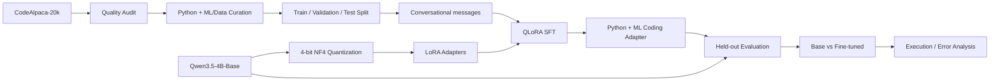

# Project 02 — Fine-Tuning Qwen3.5-4B for Python & ML Coding with QLoRA

> **Status: Fine-tuning complete · Evaluation in progress**

This repository documents an end-to-end experiment in **parameter-efficient fine-tuning of Qwen3.5-4B-Base for Python and ML/Data Science coding** using **QLoRA** on a consumer laptop with an **NVIDIA RTX 4050 Laptop GPU (6 GB VRAM)**.

The project is intentionally documented as an engineering/research experiment rather than as a simple "model fine-tuning" demo. It records the dataset audit, curation decisions, model architecture inspection, LoRA target selection, memory constraints, failed configurations, successful training run, reproducibility details, and the evaluation methodology.

This is **Project 02** in a personal **7 Weeks → 7 AI Projects** challenge.

---

## 1. Project Objective

The objective was to answer a concrete engineering question:

> **Can a 4B-parameter coding-capable base model be adapted to Python and ML/Data Science coding tasks with QLoRA on a 6 GB consumer GPU, while keeping the experiment reproducible and evaluating the resulting adapter against the original model?**

The project has five goals:

1. Establish a reproducible baseline for the base model.
2. Build a curated Python + ML/Data Science coding dataset.
3. Fine-tune Qwen3.5-4B-Base using 4-bit QLoRA.
4. Operate within a strict 6 GB VRAM constraint.
5. Evaluate the fine-tuned adapter against the untouched base model using held-out data and execution-based coding tests where compatible.

The experiment is **not** designed to prove that fine-tuning universally improves Qwen3.5. The evaluation stage is deliberately separated from training so that improvement, degradation, overfitting, or task-specific trade-offs can be measured rather than assumed.

---

## 2. High-Level Pipeline



---

# 3. Hardware and Software Environment

## Hardware

| Component | Configuration |
|---|---|
| GPU | NVIDIA GeForce RTX 4050 Laptop GPU |
| GPU VRAM | 6 GB |
| System RAM | 16 GB DDR5 |
| OS | Windows |
| Shell | PowerShell |
| Python | 3.11.9 |

The 6 GB VRAM limit is the primary engineering constraint in this project.

## Verified software stack

| Package | Version |
|---|---:|
| PyTorch | 2.12.1+cu130 |
| Transformers | 5.16.1 |
| Datasets | 5.0.1 |
| PEFT | 0.20.0 |
| TRL | 1.12.0 |
| Accelerate | 1.14.0 |
| bitsandbytes | 0.50.2 |
| safetensors | 0.8.0 |
| tokenizers | 0.23.1 |
| pandas | 3.0.5 |
| NumPy | 2.4.6 |
| requests | 2.34.2 |
| Python | 3.11.9 |

GPU validation confirmed CUDA availability and successful bitsandbytes 4-bit kernels on the RTX 4050.

---

# 4. Model

## Base model

**Qwen/Qwen3.5-4B-Base**

The base model was selected because the project specifically investigates adapting a relatively compact modern LLM rather than starting from a heavily instruction-tuned coding model.

The model was loaded using Hugging Face Transformers and 4-bit bitsandbytes quantization.

## Why QLoRA?

Full fine-tuning a 4B model is impractical under a 6 GB VRAM constraint.

QLoRA combines:

- Low-bit quantization of the frozen base model.
- Trainable low-rank LoRA matrices.
- Reduced optimizer/memory requirements.
- Parameter-efficient adaptation without updating billions of base-model parameters.

For this experiment:

```
Base model
   ↓
4-bit NF4 quantization
   ↓
Frozen quantized weights
   +
LoRA trainable adapters
   ↓
SFT training
```

Hugging Face PEFT documentation explicitly supports `target_modules="all-linear"` for QLoRA-style training and recommends NF4 for 4-bit quantization.  
Reference: https://huggingface.co/docs/peft/developer_guides/quantization

---

# 5. Initial Model Validation

Before training, the environment was validated incrementally rather than assuming the stack worked.

The validation sequence included:

1. PyTorch installation and CUDA check.
2. NumPy compatibility check.
3. Transformers / datasets / PEFT / TRL stack verification.
4. bitsandbytes CUDA kernel test.
5. 4-bit Qwen model loading.
6. Tokenizer loading.
7. Chat-template inspection.
8. Baseline generation.

This prevented a long training run from becoming the first integration test.

## 4-bit loading result

The final standalone model-load test successfully loaded all model weights:

- Architecture: `Qwen3_5ForCausalLM`
- Quantization: 4-bit NF4
- Double quantization: enabled
- Compute dtype: FP16
- Approximate allocated VRAM during load: 2.906 GB

---

# 6. Baseline Before Fine-Tuning

A baseline generation test was performed before training.

The baseline configuration was corrected to disable model thinking/reasoning for this coding experiment:

```python
enable_thinking=False
```

### Baseline result

| Metric | Result |
|---|---:|
| Prompt tokens | 28 |
| Generated tokens | 150 |
| Generation time | 15.55 s |
| Throughput | 9.65 tokens/s |
| Peak allocated VRAM | 3.152 GB |

The baseline produced a usable Python-oriented response, establishing a reference point for the later fine-tuned evaluation.

### Important baseline issue

An earlier baseline attempt used thinking-enabled generation and produced reasoning-heavy output that was unsuitable for the intended comparison.

That run was **not** used as the final baseline.

The corrected baseline uses the same generation mode planned for the fine-tuned model.

---

# 7. Dataset

## Source

**sahil2801/CodeAlpaca-20k**

Dataset fields:

- `instruction`
- `input`
- `output`

The dataset contains approximately 20k coding instruction examples and was used as the raw source for curation.

The dataset was downloaded directly from its Hugging Face repository after the dataset service returned HTTP 429 during one retrieval attempt.

Source:

https://huggingface.co/datasets/sahil2801/CodeAlpaca-20k

---

# 8. Raw Dataset Audit

Raw records:

**20,022**

Audit results:

| Check | Result |
|---|---:|
| Total records | 20,022 |
| Empty instructions | 0 |
| Empty inputs | 9,764 |
| Empty outputs | 6 |
| Duplicate records | 0 |
| Instruction minimum | 14 chars |
| Instruction median | 71 chars |
| Instruction mean | 73.8 chars |
| Instruction maximum | 288 chars |
| Input median | 5 chars |
| Input mean | 23.4 chars |
| Input maximum | 635 chars |
| Output median | 131 chars |
| Output mean | 197.0 chars |
| Output maximum | 3,905 chars |
| Outputs under 20 chars | 1,069 |

The large number of empty `input` fields is expected because the dataset schema permits an instruction without an additional input/context field.

Six records with empty outputs were removed.

Importantly, short outputs were **not** automatically deleted. A short answer can still be a valid coding answer, so length alone was not treated as a quality label.

---

# 9. Language and Domain Analysis

Initial heuristic analysis identified approximately:

| Category | Approx. count |
|---|---:|
| Python | 7,967 |
| SQL | 1,892 |
| JavaScript | 1,670 |
| Java | 746 |
| C/C++ | 462 |
| ML/Data | 421 |

The project was narrowed to **Python + ML/Data Science coding**.

## Why not finance/FinTech coding?

A finance-keyword heuristic initially returned thousands of apparent finance examples. Manual investigation showed that the keyword approach produced substantial false positives because words such as "return", "capital", "value", and "rate" occur naturally in general programming tasks.

A stricter scoring system was therefore used.

Final domain scoring showed:

| Score threshold | Count |
|---|---:|
| Python score ≥ 3 | 5,731 |
| ML score ≥ 4 | 338 |
| ML score ≥ 7 | 175 |
| Finance score ≥ 4 | 25 |
| Finance score ≥ 6 | 1 |
| Finance score ≥ 8 | 1 |

The finance/FinTech subset was rejected as too small and unreliable for a meaningful specialization.

**Decision:** specialize the experiment in **Python + ML/Data Science coding**, not FinTech coding.

This is an important methodological decision because it avoids claiming a domain specialization that the source dataset cannot actually support.

---

# 10. Final Dataset Construction

After cleaning:

- Raw records: 20,022
- Empty outputs removed: 6
- Remaining: 20,016
- Duplicate records after cleaning: 0
- Unique prompt/input pairs: 20,016

The final dataset was constructed from:

- **5,000 general Python examples**
- **338 ML/Data Science examples**

Total:

**5,338 examples**

The final composition is approximately:

- 93.7% general Python
- 6.3% ML/Data Science

This is **not** an 80/20 split. The available high-confidence ML/Data subset was only 338 examples, so the final dataset retained 5,000 general Python examples plus all 338 examples meeting the selected ML/Data threshold.

---

# 11. Train / Validation / Test Split

Random seed:

```
42
```

Split:

| Split | Examples |
|---|---:|
| Training | 4,270 |
| Validation | 534 |
| Test | 534 |
| Total | 5,338 |

The split was explicitly checked for prompt/input leakage.

Results:

- Train ↔ Validation overlap: **0**
- Train ↔ Test overlap: **0**
- Validation ↔ Test overlap: **0**

The 534-example test set was held out from fine-tuning.

---

# 12. Conversational Dataset Format

The final JSONL examples use:

```json
{
  "messages": [
    {
      "role": "user",
      "content": "..."
    },
    {
      "role": "assistant",
      "content": "..."
    }
  ]
}
```

Files:

```
data/train/train.jsonl
data/validation/validation.jsonl
data/test/test.jsonl
data/dataset_manifest.json
```

TRL supports conversational datasets and can calculate loss on assistant responses using `assistant_only_loss=True`.  
Reference: https://huggingface.co/docs/trl/sft_trainer

---

# 13. Token-Length Investigation

A token-length audit was attempted before training.

The first audit implementation was found to be incorrect because it measured the length of a structured tokenizer return object rather than the actual token ID sequence.

The mistake produced repeated values of `2`, which were immediately recognized as invalid.

The audit logic was corrected to:

1. Apply the Qwen chat template with `tokenize=False`.
2. Tokenize the resulting text.
3. Measure the actual `input_ids` length.

This is documented as part of the engineering record rather than silently removing the failed result.

A scan of the training data identified a longest example of approximately **1,786 tokens**.

---

# 14. Qwen3.5 Architecture Inspection

The model architecture was inspected before choosing LoRA targets.

The inspection found:

- 249 `nn.Linear` modules.
- Conventional attention projections:
  - `q_proj`
  - `k_proj`
  - `v_proj`
  - `o_proj`
- MLP projections:
  - `gate_proj`
  - `up_proj`
  - `down_proj`
- Hybrid/linear-attention projections such as:
  - `in_proj_qkv`
  - `in_proj_z`
  - `in_proj_b`
  - `in_proj_a`
  - `out_proj`

This architecture inspection mattered because simply targeting conventional `q_proj` / `v_proj` modules would not cover the full set of linear transformations present in the model.

---

# 15. LoRA Target Selection

The final configuration used:

```python
LoraConfig(
    r=16,
    lora_alpha=32,
    lora_dropout=0.05,
    bias="none",
    target_modules="all-linear",
    task_type="CAUSAL_LM",
)
```

Why `all-linear`?

Because the model contains multiple kinds of linear projections and a narrow attention-only target could miss important parts of the architecture.

PEFT documents `all-linear` as a supported QLoRA-style target selection strategy.  
Reference: https://huggingface.co/docs/peft/developer_guides/quantization

## LoRA verification

The adapter attached successfully to:

- 248 targeted modules
- 32,464,896 trainable parameters
- 4,238,216,192 total parameters

Trainable fraction:

**0.766%**

This means the experiment updated only a small fraction of the total model parameters while keeping the quantized base model frozen.

---

# 16. QLoRA Configuration

Quantization:

```python
BitsAndBytesConfig(
    load_in_4bit=True,
    bnb_4bit_quant_type="nf4",
    bnb_4bit_compute_dtype=torch.float16,
    bnb_4bit_use_double_quant=True,
)
```

The important choices were:

- 4-bit loading
- NF4 quantization
- Double quantization
- FP16 compute
- LoRA adapters on all linear layers

---

# 17. Training Configuration

Final configuration:

```text
Model:
  Qwen/Qwen3.5-4B-Base

Dataset:
  4,270 training examples
  534 validation examples

Sequence length:
  256

Per-device train batch:
  1

Per-device eval batch:
  1

Gradient accumulation:
  8

Effective batch size:
  8

Epochs:
  1

Learning rate:
  1e-4

Weight decay:
  0.01

Warmup steps:
  16

LR scheduler:
  cosine

Optimizer:
  paged_adamw_8bit

Gradient checkpointing:
  enabled

Gradient checkpointing mode:
  use_reentrant=False

Packing:
  disabled

Assistant-only loss:
  enabled

Seed:
  42

Data seed:
  42

Checkpoint retention:
  2

Workers:
  0

Hub push:
  disabled
```

TRL's SFT configuration supports assistant-only loss for conversational datasets; this was used so that training loss focuses on the assistant/code response rather than the user's prompt.  
Reference: https://huggingface.co/docs/trl/sft_trainer

---

# 18. Why the Maximum Sequence Length Became 256

This was determined experimentally rather than chosen arbitrarily.

A memory stress test was run at 512 tokens.

### 512-token stress test

Measured approximately:

- Peak allocated VRAM: **6.279 GB**
- Peak reserved VRAM: **6.604 GB**

This exceeds the physical 6 GB VRAM capacity.

Therefore:

> **512 tokens was rejected as unsafe for the final training configuration.**

The final configuration used:

**256 tokens**

Actual training at 256 tokens completed successfully with:

- Peak allocated VRAM: **5.443 GB**
- Peak reserved VRAM: **5.756 GB**

This left a small but usable margin on the 6 GB GPU.

---

# 19. Dry-Run Validation

Before committing to the full training run, a real training example was used to validate:

1. Forward pass.
2. Backward pass.
3. Gradient creation.
4. Optimizer step.

The dry run succeeded.

Peak GPU memory during the dry run was approximately:

**4.799 GB**

This validated the training pipeline before spending hours on the complete dataset.

---

# 20. Training Failures and Engineering Debugging

A major goal of the project was to retain the actual engineering process rather than documenting only the successful final run.

## Failure 1 — Native Windows crash during model loading

One run terminated with:

```
EXIT CODE: -1073741819
0xC0000005
```

This was a Windows access-violation/native crash occurring during model loading.

A system reboot was performed.

After reboot, the standalone 4-bit Qwen load completed successfully.

---

## Failure 2 — Training interrupted before a usable checkpoint

An early run was interrupted around step 8.

No valid resumable checkpoint existed.

The training script was subsequently made restart-aware.

---

## Failure 3 — Invalid/incomplete checkpoint

A later run reached approximately step 25 and the laptop crashed.

A `checkpoint-25` directory existed, but it did **not** contain `trainer_state.json`.

Because the trainer state was missing, the checkpoint was not considered safely resumable.

The incomplete checkpoint was deleted rather than pretending it was valid.

---

## Failure 4 — Mixed-precision scaler error

A training configuration using:

```python
fp16=True
bf16=False
```

failed during the first optimizer step with:

```
NotImplementedError:
"_amp_foreach_non_finite_check_and_unscale_cuda"
not implemented for 'BFloat16'
```

The final configuration disabled both trainer-level FP16 and BF16 mixed-precision modes:

```python
bf16=False
fp16=False
```

while retaining FP16 as the compute dtype for the 4-bit quantized model.

The subsequent full training run completed successfully.

---

# 21. Final Training Run

The final run completed:

```
534 / 534 steps
Epoch: 1.0
```

Final metrics:

| Metric | Result |
|---|---:|
| Train runtime | 5,318.7316 s |
| Train samples/sec | 0.803 |
| Train steps/sec | 0.100 |
| Training FLOPs estimate | 1.0425e16 |
| Final training loss | 0.08355 |
| Epoch | 1.0 |
| Peak allocated VRAM | 5.443 GB |
| Peak reserved VRAM | 5.756 GB |

Validation metrics observed near the end of training:

| Metric | Result |
|---|---:|
| Validation loss | ~0.3977 |
| Validation runtime | ~268.1 s |
| Validation samples/sec | ~1.992 |
| Validation steps/sec | ~1.992 |
| Validation entropy | ~0.4091 |
| Validation token count | ~98,950 |
| Mean token accuracy | ~0.8814 |

---

# 22. Interpreting the Training Metrics

The training loss of approximately **0.0836** is much lower than the validation loss of approximately **0.3977**.

That gap is important.

It should **not** be interpreted as proof that the model failed, but it is a signal that requires evaluation.

Possible explanations include:

- The model fit the training distribution strongly.
- The validation set differs in difficulty from the training examples.
- The synthetic source dataset contains heterogeneous coding tasks.
- The one-epoch training run may still create distribution-specific adaptation.
- Token-level accuracy and loss do not directly measure executable code correctness.

Therefore the project does **not** declare success based on training loss.

The decisive comparison is the held-out evaluation and execution-based testing.

---

# 23. Checkpoint and Adapter Handling

The training script was designed to avoid blindly resuming from incomplete checkpoint directories.

A checkpoint is considered valid for automatic resume only when the checkpoint directory and:

```
trainer_state.json
```

are both present.

The final adapter was saved to:

```
model/qwen3.5-4b-python-qlora
```

Large model files and checkpoints are intentionally excluded from Git.

---

# 24. Evaluation Methodology

The next stage compares:

### Model A — Baseline

```
Qwen/Qwen3.5-4B-Base
```

### Model B — Fine-tuned

```
Qwen/Qwen3.5-4B-Base
+
qwen3.5-4b-python-qlora
```

The comparison must use:

- The same test prompts.
- The same tokenizer.
- The same chat template.
- `enable_thinking=False`.
- The same generation length.
- Deterministic generation where possible.
- No access to the held-out assistant answers during generation.

---

# 25. Planned Evaluation Metrics

## A. Held-out test loss

Evaluate both models on the 534-example test set.

This provides a quantitative measure of language-model likelihood on unseen project-domain examples.

Perplexity can be calculated as:

```
PPL = exp(loss)
```

where the loss is computed consistently between the two models.

---

## B. Generation quality

Use a fixed set of coding prompts and compare:

- Correctness
- Completeness
- Relevance
- Python syntax
- Explanation quality
- Error handling
- ML/API usage

---

## C. Code execution

Where generated answers contain executable Python:

1. Extract the generated code.
2. Run it in an isolated evaluation process.
3. Capture stdout/stderr.
4. Check expected behavior.
5. Record pass/fail.

This is more meaningful for coding than relying only on token-level accuracy.

---

## D. Execution-based benchmark

Where compatible with the model's format and hardware, evaluate on an established coding benchmark such as HumanEval or MBPP.

The benchmark implementation and exact version will be recorded in the repository so that the reported number is reproducible.

---

## E. Error analysis

Examples will be categorized into failure modes such as:

- Syntax error
- Wrong algorithm
- Wrong API
- Missing import
- Incorrect assumptions
- Incomplete solution
- Hallucinated library/function
- Edge-case failure
- Correct code but poor explanation

---

# 26. Important Evaluation Caveat

CodeAlpaca-20k is a synthetic instruction dataset whose outputs were generated using text-davinci-003.

Therefore:

> A lower test loss on CodeAlpaca-style examples does not automatically mean better real-world programming ability.

That is why the project includes execution-based evaluation.

The strongest evidence will come from a combination of:

- Held-out loss
- Deterministic generation comparisons
- Executable test cases
- Established coding benchmarks
- Qualitative error analysis

---

# 27. Reproducibility

Core seeds:

```
SEED = 42
DATA_SEED = 42
```

Important final configuration:

```text
max_length = 256
batch_size = 1
gradient_accumulation = 8
epochs = 1
learning_rate = 1e-4
weight_decay = 0.01
warmup_steps = 16
scheduler = cosine
optimizer = paged_adamw_8bit
lora_r = 16
lora_alpha = 32
lora_dropout = 0.05
target_modules = all-linear
quantization = 4-bit NF4
double_quant = true
compute_dtype = float16
assistant_only_loss = true
gradient_checkpointing = true
```

---

# 28. Repository Structure

```
Project-02-ML-Coding/
│
├── data/
│   ├── train/
│   ├── validation/
│   ├── test/
│   ├── dataset_manifest.json
│   └── code_alpaca_20k.json          # local only / ignored
│
├── experiments/
│   ├── inspect_lora_targets.py
│   ├── verify_lora.py
│   ├── qlora_dry_run.py
│   ├── qlora_memory_stress_test.py
│   ├── train_qlora.py
│   └── evaluation scripts              # added during evaluation
│
├── model/
│   └── qwen3.5-4b-python-qlora/       # local only / ignored
│
├── docs/
│   ├── PROJECT_STATUS.md
│   └── ...
│
├── README.md
└── .gitignore
```

Large binary artifacts are deliberately excluded from the public repository.

---

# 29. Evidence / Screenshots

The project development log contains screenshots documenting the major stages.

Recommended report figures:

1. PyTorch + CUDA baseline
2. Package stack
3. bitsandbytes CUDA/NF4 validation
4. Successful Qwen 4-bit model load
5. Baseline generation
6. Raw dataset inspection
7. Dataset quality audit
8. Dataset curation
9. Domain scoring
10. Final dataset construction and leakage verification
11. JSONL format verification
12. Qwen3.5 architecture inspection
13. LoRA adapter and trainable-parameter verification
14. QLoRA forward/backward/optimizer dry run
15. 512-token memory stress test
16. Final QLoRA training completion and metrics

The most important final-training evidence is the screenshot showing:

```
534/534
train_runtime: 5318.7316
train_loss: 0.0835487992
Peak allocated VRAM: 5.443 GB
Peak reserved VRAM: 5.756 GB
QLORA TRAINING COMPLETE
```

GitHub-rendered Mermaid diagrams are used in this README for architecture and workflow visuals. Raw screenshots are kept out of the repository unless/ until they are added to a dedicated `docs/assets/` folder.

---

# 30. Engineering Lessons

### Lesson 1 — Validate the stack before training

The project encountered CUDA, native Windows, tokenizer, mixed-precision, and checkpoint issues before the final successful run.

Small validation tests dramatically reduced wasted training time.

### Lesson 2 — Architecture inspection matters

A generic `q_proj/v_proj` LoRA target would not represent the full hybrid Qwen3.5 architecture inspected in this experiment.

### Lesson 3 — VRAM determines sequence length

The 512-token stress test exceeded the GPU's physical capacity. The final 256-token configuration was chosen from measured behavior rather than guesswork.

### Lesson 4 — A checkpoint directory is not necessarily a valid checkpoint

The presence of `checkpoint-25` alone was not treated as sufficient. Trainer state was required before resuming.

### Lesson 5 — Training loss is not coding ability

The final training loss was low, but the validation loss remained materially higher. Execution-based evaluation is therefore essential.

### Lesson 6 — Keyword filtering is not domain curation

A broad finance keyword filter produced thousands of false positives. The final project explicitly rejected that misleading specialization.

---

# 31. Current Status

### Completed

- [x] Environment setup
- [x] CUDA verification
- [x] bitsandbytes verification
- [x] Qwen3.5-4B 4-bit loading
- [x] Baseline generation
- [x] Dataset download
- [x] Dataset quality audit
- [x] Dataset curation
- [x] Domain scoring
- [x] Train/validation/test split
- [x] Leakage checks
- [x] Conversational JSONL conversion
- [x] Model architecture inspection
- [x] LoRA target selection
- [x] Trainable parameter verification
- [x] QLoRA dry run
- [x] Memory stress test
- [x] Full QLoRA training
- [x] Final adapter saved

### In progress / next

- [ ] Held-out test evaluation
- [ ] Base vs fine-tuned generation comparison
- [ ] Code execution evaluation
- [ ] HumanEval/MBPP compatibility check
- [ ] Error analysis
- [ ] Final quantitative comparison
- [ ] Final project report

---

# 32. References

- Qwen model repository: https://huggingface.co/Qwen/Qwen3.5-4B-Base
- CodeAlpaca-20k: https://huggingface.co/datasets/sahil2801/CodeAlpaca-20k
- Hugging Face PEFT quantization / QLoRA documentation: https://huggingface.co/docs/peft/developer_guides/quantization
- Hugging Face PEFT LoRA documentation: https://huggingface.co/docs/peft/en/package_reference/lora
- Hugging Face TRL SFTTrainer documentation: https://huggingface.co/docs/trl/sft_trainer
- Hugging Face TRL PEFT integration: https://github.com/huggingface/trl/blob/main/docs/source/peft_integration.md

---

## Final Note

This repository intentionally documents both the successful result and the failures encountered on the way to it.

The goal is not simply to show that a QLoRA adapter was produced. The goal is to make the experiment **auditable, reproducible, resource-aware, and quantitatively testable**.

**Fine-tuning is complete. Evaluation determines whether the adaptation actually helped.**
